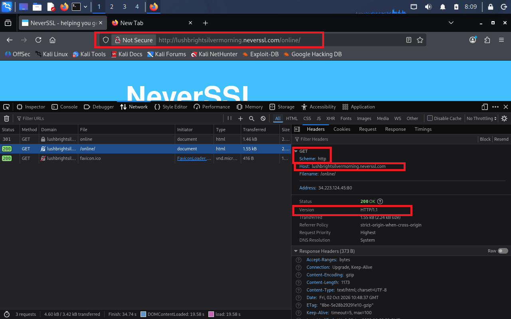
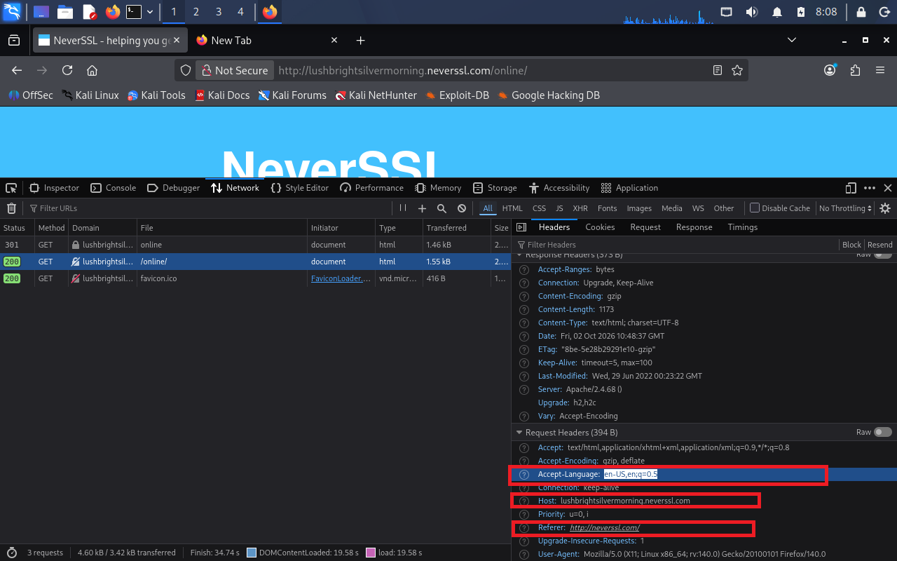
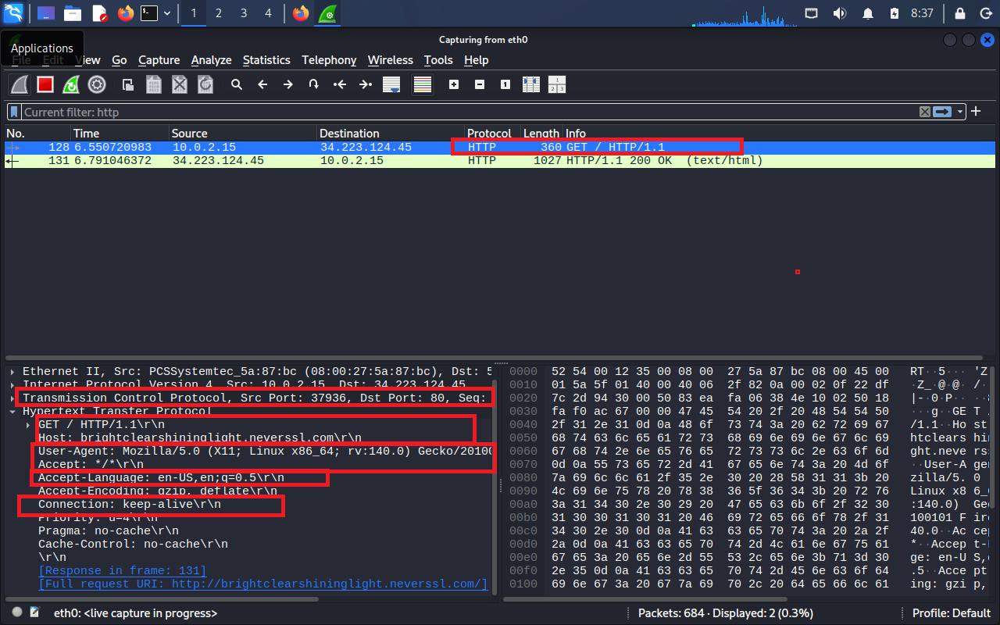

# PRE-ENTREGA 6: Seguridad en el aire: cómo sobrevivir a una Wi-Fi pública

## Introducción

En este trabajo, voy a simular la tarea de un analista junior en ciberseguridad. Voy a analizar una conexión HTTP, observar qué información queda visible durante la solicitud y evaluar el riesgo de conectarme a un sitio web que utiliza HTTP desde una red Wi-Fi pública. También voy a analizar la importancia de utilizar una VPN para reducir ese riesgo.

## Sitio analizado

En mi caso, analicé el sitio web `http://neverssl.com`. Este sitio me sirve para la práctica ya que utiliza el protocolo HTTP, permitiendo observar información transmitida sin cifrado y en texto plano.

## Evidencia observada

Analizando el sitio web mediante DevTools, pude observar la siguiente información:

- URL completa observada: `http://lushbrightsilvermorning.neverssl.com/online/`
- Método: `GET`
- Host: `lushbrightsilvermorning.neverssl.com`
- Versión: `HTTP/1.1`
- Referer: `http://neverssl.com/`
- Accept-Language: `en-US,en;q=0.5`

### Evidencias en DevTools

## Análisis del tráfico HTTP con Wireshark

Al analizar el tráfico mediante Wireshark utilizando el filtro `http`, pude identificar una petición GET realizada desde mi equipo hacia el servidor de NeverSSL. En la captura se observa la petición `GET / HTTP/1.1` y el Host `brightclearshininglight.neverssl.com`, por lo que la URL completa solicitada es:

`http://brightclearshininglight.neverssl.com/`

También fue posible observar en texto plano diferentes headers de la solicitud, como User-Agent, Accept, Accept-Language y Connection.

Esta captura demuestra el riesgo de utilizar HTTP, ya que estos datos pueden observarse de forma legible al analizar el tráfico de red. Al no existir cifrado TLS en esta comunicación HTTP, un atacante que consiga interceptar el tráfico podría acceder a información transmitida mediante la conexión, comprometiendo su confidencialidad.
### Evidencia en Wireshark

### Archivo de captura

El archivo de captura utilizado durante el análisis está disponible para su revisión:

[Descargar captura de tráfico HTTP (.pcapng)](evidencias/captura-http-neverssl.pcapng)
## Riesgos encontrados

Usar una web HTTP conectado desde una red Wi-Fi pública representa un riesgo porque el tráfico no está cifrado. Si un atacante logra interceptarlo, podría comprometerse la confidencialidad de información como credenciales, datos introducidos en formularios, mensajes o cookies de sesión.

## Cómo ayuda una VPN

Una VPN crea un túnel cifrado entre el dispositivo del usuario y el servidor VPN. Esto protege el tráfico frente a otros usuarios conectados a la misma red Wi-Fi pública.
Con una VPN activa, Wireshark seguiría mostrando tráfico de red, pero la información viajaría cifrada dentro del túnel VPN. Por eso, datos que sin VPN pude observar directamente, como la petición GET, el Host y los headers HTTP, ya no serían legibles de la misma manera.

## 3 reglas de oro

1. **Verificar que el sitio utilice HTTPS:** antes de introducir información personal, comprobar que la conexión utiliza HTTPS. Esto permite que la comunicación entre el navegador y el sitio esté protegida mediante TLS. HTTPS no garantiza que el sitio sea legítimo, pero sí protege los datos durante su transmisión.

2. **Utilizar una VPN en redes Wi-Fi públicas:** una VPN crea un túnel cifrado entre nuestro dispositivo y el servidor VPN, dificultando que otras personas conectadas a la red pública puedan leer el tráfico interceptado.

3. **Utilizar datos móviles para operaciones sensibles:** para realizar operaciones como transferencias bancarias, pagos o envío de información especialmente sensible, es preferible utilizar datos móviles o un hotspot propio en lugar de una red Wi-Fi pública.
